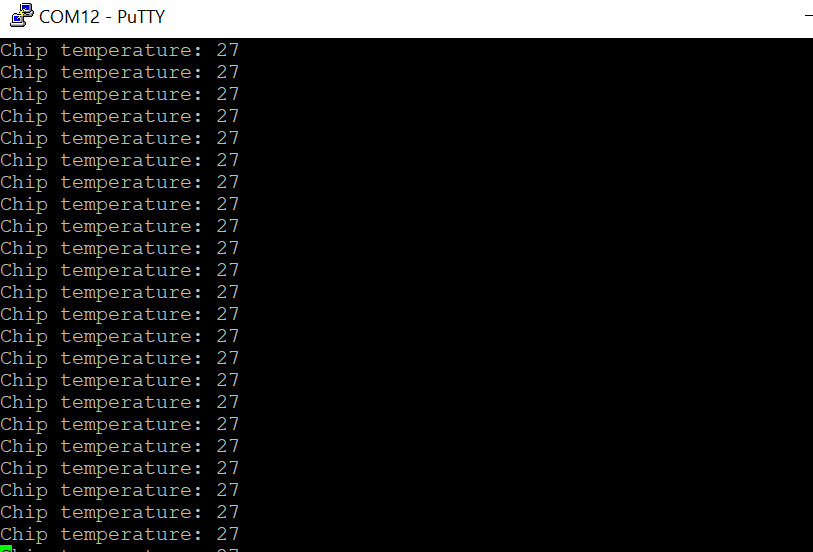
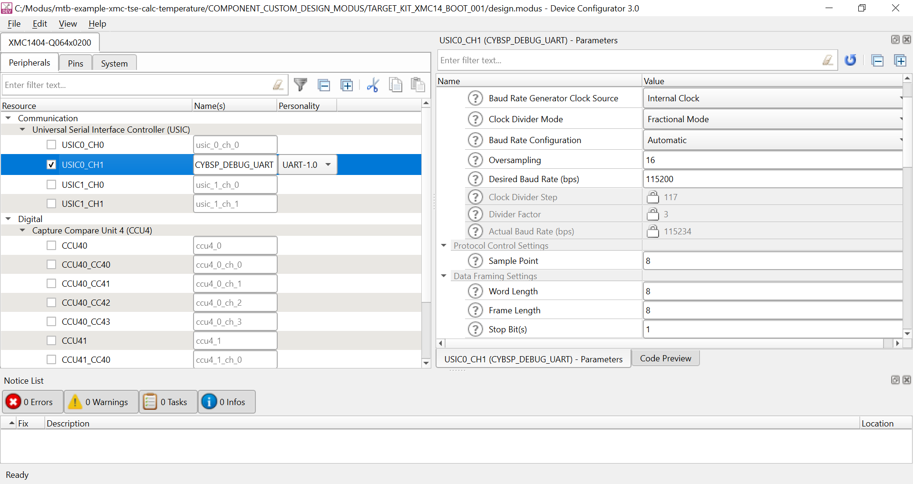
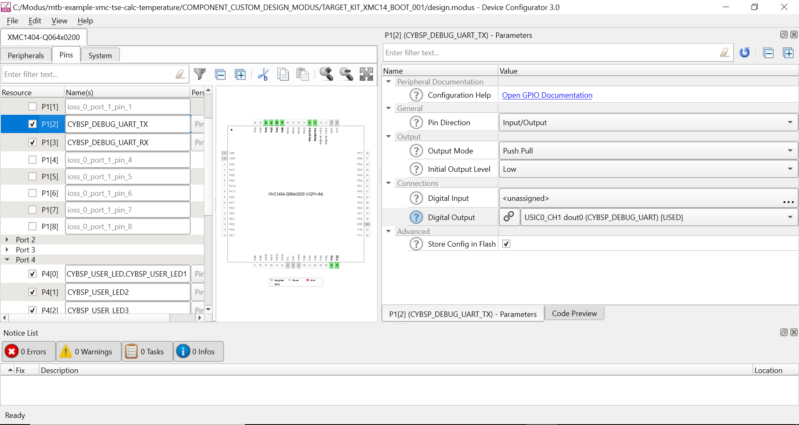
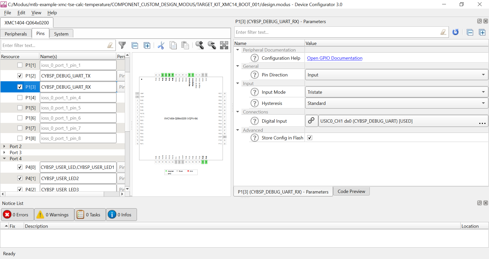
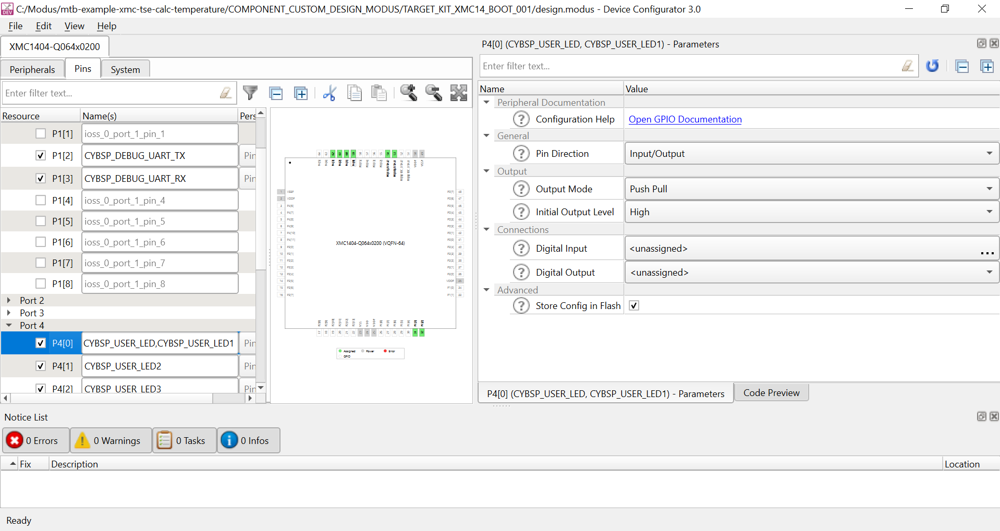
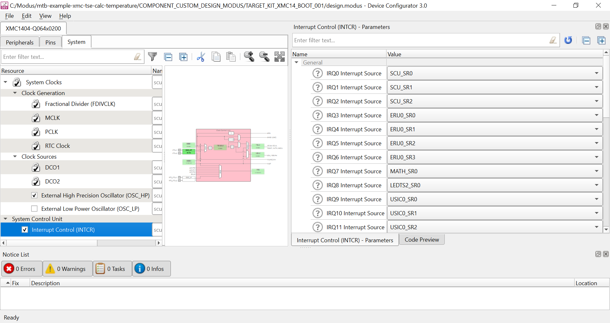

# XMC MCU: TSE Calc Temperature

This code example demonstrates how to use TSE (on-chip temperature sensor). TSE calculates temperature readings from the sensor and sends them over UART periodically every 1 s. Correspondingly, the LED blinks every 1 s; the temperature readings can be observed on the terminal.

The XMC1000 family of devices provides a Temperature Sensor (DTS) peripheral which measures and indicates the current temperature of the chip (not the ambient temperature of the environment). The DTS Temperature Sensor is also referred to as ‘TSE’. The SCU XMC™ Lib `XMC_SCU_CalcTemperature` function can be used to determine the current chip temperature using the `TSE_MON` value.

## Requirements

- [ModusToolbox&trade; software](https://www.cypress.com/products/modustoolbox-software-environment) v2.3
- [SEGGER J-Link software](https://www.segger.com/downloads/jlink/#J-LinkSoftwareAndDocumentationPack)
- Programming Language: C
- Associated Parts: All [XMC™ MCU](https://www.infineon.com/cms/en/product/microcontroller/32-bit-industrial-microcontroller-based-on-arm-cortex-m/) parts

## Supported Toolchains (make variable 'TOOLCHAIN')

- GNU Arm® Embedded Compiler v9.3.1 (`GCC_ARM`) - Default value of `TOOLCHAIN`

## Supported Kits (make variable 'TARGET')

- [XMC1400 Boot Kit](https://www.infineon.com/cms/en/product/evaluation-boards/kit_xmc14_boot_001/) (`KIT_XMC14_BOOT_001`) - Default value of `TARGET`

## Hardware Setup

This example uses the board's default configuration. See the kit user guide to ensure that the board is configured correctly.

## Software Setup

Install a terminal emulator if you don't have one. Instructions in this document use [Tera Term](https://ttssh2.osdn.jp/index.html.en).

This example requires no additional software or tools.

## Using the Code Example

Create the project and open it using one of the following:

<b>In Eclipse IDE for ModusToolbox</b>

1. Click the **New Application** link in the **Quick Panel** (or, use **File** > **New** > **ModusToolbox Application**). This launches the [Project Creator](http://www.cypress.com/ModusToolboxProjectCreator) tool.

2. Pick a kit supported by the code example from the list shown in the **Project Creator - Choose Board Support Package (BSP)** dialog.

   When you select a supported kit, the example is reconfigured automatically to work with the kit. To work with a different supported kit later, use the [Library Manager](https://www.cypress.com/ModusToolboxLibraryManager) to choose the BSP for the supported kit. You can use the Library Manager to select or update the BSP and firmware libraries used in this application. To access the Library Manager, click the link from the **Quick Panel**.

   You can also just start the application creation process again and select a different kit.

   If you want to use the application for a kit not listed here, you may need to update the source files. If the kit does not have the required resources, the application may not work.

3. In the **Project Creator - Select Application** dialog, choose the example by enabling the checkbox.

4. Optionally, change the suggested **New Application Name**.

5. Enter the local path in the **Application(s) Root Path** field to indicate where the application needs to be created.

   Applications that can share libraries can be placed in the same root path.

6. Click **Create** to complete the application creation process.

For more details, see the [Eclipse IDE for ModusToolbox User Guide](https://www.cypress.com/MTBEclipseIDEUserGuide) (locally available at *{ModusToolbox install directory}/ide_{version}/docs/mt_ide_user_guide.pdf*).

<b>In Command-line Interface (CLI)</b>

ModusToolbox provides the Project Creator as both a GUI tool and a command line tool to easily create one or more ModusToolbox applications. See the "Project Creator Tools" section of the [ModusToolbox User Guide](https://www.cypress.com/ModusToolboxUserGuide) for more details.

Alternatively, you can manually create the application using the following steps:

1. Download and unzip this repository onto your local machine, or clone the repository.

2. Open a CLI terminal and navigate to the application folder.

   On Linux and macOS, you can use any terminal application. On Windows, open the **modus-shell** app from the Start menu.

   **Note:** The cloned application contains a default BSP file (*TARGET_xxx.mtb*) in the *deps* folder. Use the [Library Manager](https://www.cypress.com/ModusToolboxLibraryManager) (`make modlibs` command) to select and download a different BSP file, if required. If the selected kit does not have the required resources or is not [supported](#supported-kits-make-variable-target), the application may not work.

3. Import the required libraries by executing the `make getlibs` command.

Various CLI tools include a `-h` option that prints help information to the terminal screen about that tool. For more details, see the [ModusToolbox User Guide](https://www.cypress.com/ModusToolboxUserGuide) (locally available at *{ModusToolbox install directory}/docs_{version}/mtb_user_guide.pdf*).

<b>In Third-party IDEs</b>

**Note:** Only VS Code is supported.

1. Follow the instructions from the **In Command-line Interface (CLI)** section to create the application, and import the libraries using the `make getlibs` command.

2. Export the application to a supported IDE using the `make <ide>` command.

   For a list of supported IDEs and more details, see the "Exporting to IDEs" section of the [ModusToolbox User Guide](https://www.cypress.com/ModusToolboxUserGuide) (locally available at *{ModusToolbox install directory}/docs_{version}/mtb_user_guide.pdf*).

3. Follow the instructions displayed in the terminal to create or import the application as an IDE project.

## Operation

1. Connect your Windows PC to the XMC Boot Kit via a micro-USB cable.

2. Open a terminal program and select the *JLINK CDC UART Port*. Set the serial port parameters to 8N1 and 115200 baud.

3. Program the board using Eclipse IDE for ModusToolbox:

   1. Select the application project in the Project Explorer.

   2. In the **Quick Panel**, scroll down, and click **\<Application Name> Program (JLink)**.

4. After programming, the application starts automatically. The temperature readings will be displayed over the terminal.

   **Figure 1. Terminal output on program startup**

   

## Debugging

You can debug the example to step through the code. In the IDE, use the **\<Application Name> Debug (Jlink)** configuration in the **Quick Panel**. For more details, see the "Program and Debug" section in the [Eclipse IDE for ModusToolbox User Guide](https://www.cypress.com/MTBEclipseIDEUserGuide).

## Design and Implementation

This example first initializes the device and board peripherals with the `cybsp_init` function, and then starts the UART peripheral. The `XMC_UART_CH_Start()` function configures the parameters for UART 0, channel 1. It then configures the SysTick timer at a period of 1 ms and starts the temperature measurement.

When the SysTick handler is triggered, the code example increments the `tick` variable; when the tick count reaches 1000, the LED is toggled and the temperature is calculated. The temperature value obtained is in kelvin, which is then converted to degree celsius. This value is then periodically printed on the terminal via UART every 1 s.

The following settings are made:

- The desired baud rate is set to 115200 and the respective Rx and Tx pins are configured.

   **Figure 2. CYBSP_DEBUG_UART Configuration**

   

 

- The pin direction is set as **Input/Output** and the mode is set as **Push Pull**.

   **Figure 3. CYBSP_DEBUG_UART_Tx Configuration**

   

 

- The pin mode is set to **Tristate** because the pin is not being used.

   **Figure 4. CYBSP_DEBUG_UART_Rx Configuration**

   

 

- The pin direction is set as **Input/Output** and the mode is set as **Push Pull**.

   **Figure 5. CYBSP_USER_LED Configuration**

   

 

- Parameters for INTCR (Interrupt Control) are configured as follows:

   **Figure 6. CYBSP_INTCR Configuration**

   

## Related Resources

| Kit Guides                                            |                                                              |
| :----------------------------------------------------------- | :----------------------------------------------------------- |
| [XMC1400 Boot Kit](https://www.infineon.com/dgdl/Infineon-Board_Users_Manual_XMC1400_Boot_Kit.pdf-UM-v01_00-EN.pdf?fileId=5546d462525dbac401527815f9a073fd) – Board User‘s Manual | Describes the schematic and hardware of XMC1400 Boot Kit for application code development on the XMC1404-Q064X0200 device.|
| [AP32323](https://www.infineon.com/dgdl/Infineon-ApplicationNote_How_To_Use_On-Chip_Temperature_Sensor_XMC1000-AN-v01_03-EN.pdf?fileId=5546d462525dbac401531c6aadc94791) – Application Note | Describes how to use the on-chip temperature sensor.|
| **Code Examples**                                            |                                                              |
| [Using ModusToolbox](https://github.com/cypresssemiconductorco/Code-Examples-for-ModusToolbox-Software) |
| **Device Documentation**                                     |                                                              |
| [XMC1000 Family Datasheets](https://www.infineon.com/cms/en/product/microcontroller/32-bit-industrial-microcontroller-based-on-arm-cortex-m/32-bit-xmc1000-industrial-microcontroller-arm-cortex-m0/#document-group-myInfineon-49) | [XMC1000 Family Technical Reference Manuals](https://www.infineon.com/cms/en/product/microcontroller/32-bit-industrial-microcontroller-based-on-arm-cortex-m/32-bit-xmc1000-industrial-microcontroller-arm-cortex-m0/#document-group-myInfineon-44) |
| **Development Kits**                                         | Buy at www.infineon.com                                       |
| [KIT_XMC14_BOOT_001](https://www.infineon.com/cms/en/product/evaluation-boards/kit_xmc14_boot_001/) Boot Kit XMC1400 |
| **Libraries**                                                 |                                                              |
| XMC Peripheral Library (XMCLib) and docs  | [mtb-xmclib-cat3](https://github.com/cypresssemiconductorco/mtb-xmclib-cat3) on GitHub |
| **Tools**                                                    |                                                              |
| [Eclipse IDE for ModusToolbox](https://www.cypress.com/modustoolbox)     | The cross-platform, Eclipse-based IDE for IoT designers that supports application configuration and development targeting converged MCU and wireless systems.

## Other Resources

Infineon provides a wealth of data at www.infineon.com to help you select the right device, and quickly and effectively integrate it into your design.

For XMC MCU devices, see [32-bit XMC™ Industrial Microcontroller based on Arm® Cortex®-M](https://www.infineon.com/cms/en/product/microcontroller/32-bit-industrial-microcontroller-based-on-arm-cortex-m/).

## Document History

Document Title: *CE232668* - *XMC MCU: TSE Calc Temperature*

| Version | Description of Change |
| ------- | --------------------- |
| 1.0.0   | New code example      |
------

All other trademarks or registered trademarks referenced herein are the property of their respective owners.

© 2021 Infineon Technologies AG

All Rights Reserved.

### Legal Disclaimer

The information given in this document shall in no event be regarded as a guarantee of conditions or characteristics. With respect to any examples or hints given herein, any typical values stated herein and/or any information regarding the application of the device, Infineon Technologies hereby disclaims any and all warranties and liabilities of any kind, including without limitation, warranties of non-infringement of intellectual property rights of any third party.

### Information

For further information on technology, delivery terms and conditions and prices, please contact the nearest Infineon Technologies Office (www.infineon.com).

### Warnings

Due to technical requirements, components may contain dangerous substances. For information on the types in question, please contact the nearest Infineon Technologies Office.

Infineon Technologies components may be used in life-support devices or systems only with the express written approval of Infineon Technologies, if a failure of such components can reasonably be expected to cause the failure of that life-support device or system or to affect the safety or effectiveness of that device or system. Life support devices or systems are intended to be implanted in the human body or to support and/or maintain and sustain and/or protect human life. If they fail, it is reasonable to assume that the health of the user or other persons may be endangered.

-------------------------------------------------------------------------------
